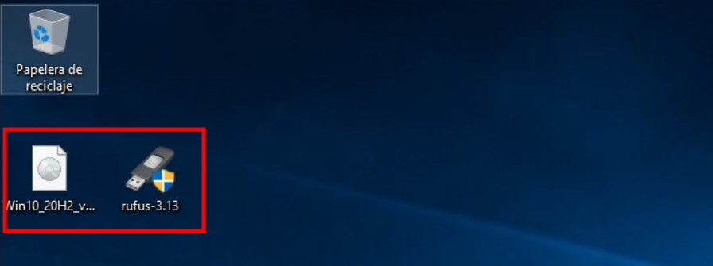
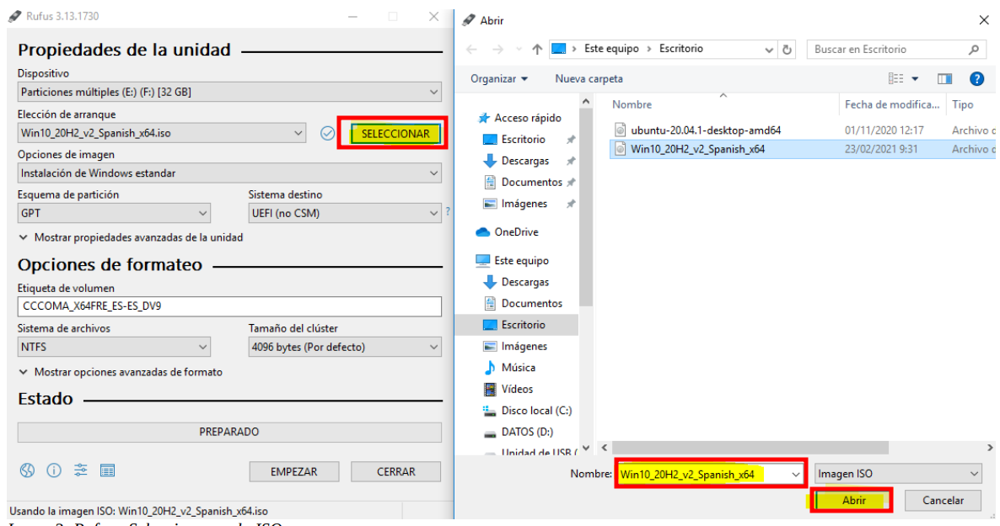
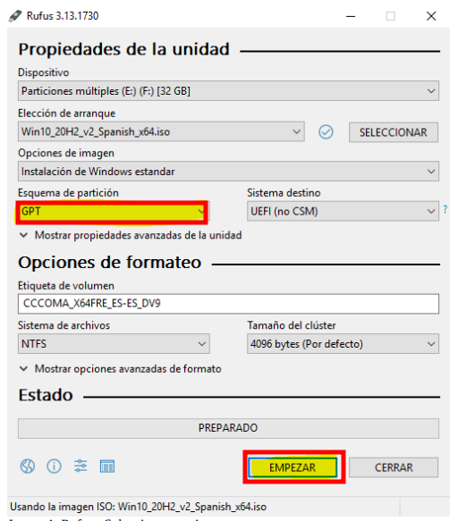
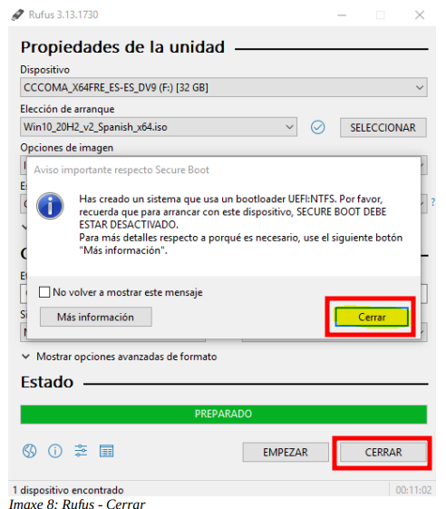

# 🪟🚫 error_0xc0000098
 

**🚫⚠️ Error de Actulizaciones de Windows** 
 

En este repositorio vamos a ver cómo actuar frente al **``error 0xc0000098``** , uno de los problemas más comunes en Windows.
   - 🔧 Analizaremos su causa
   - 🛠️ Exploraremos soluciones paso a paso
   - ⬆️ Y cómo evitarlo en futuras actualizaciones del sistema

 

## 1. 🚀 Solición Rápida

Arranca con un medio de instalación *``(USB/DVD)'``* de Windows . Y ahí instala 
el sistema operativo desde el principio .

1 - Lo primero que tenemos que hacer es descargar e instalar los paquetes necesarios para la recuperación del sistema , lo que vamos ha utilizar es **``RUFUS``** y una **``ISO``** de windows .

 
 

2 - Luego iniciamos el **``RUFUS``** , selecioanamos la iso que hemos descargado y le damos formato 

 
 

3 - Seleccionamos el formato **``GPT``** (para equipos actuales) o **``MBR``** (para equipos antiguos)
usalo segun tu equipo y le hacemos clic en el botón de empezar .

 
 

4 - Una vez empezando la instalación nos muestra un mensaje de advertencia que nos dice que se borran todos los datos de nuestro **``USB``** y solo quedara en medio de isntalación .

 
 

5 - Cuando termine hacemos clic en **``CERRAR``** porque si hacemos clic en empezar , nos empezara la instalación de nuevo , ojo con eso .

 
 

**⚠️ Inconveniente**

>Si haces esto vas ha perder todos los datos que tienes ahí y se borran todas las actulizaciones que pudieron corromper al sistema