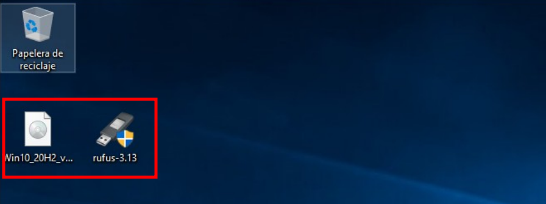
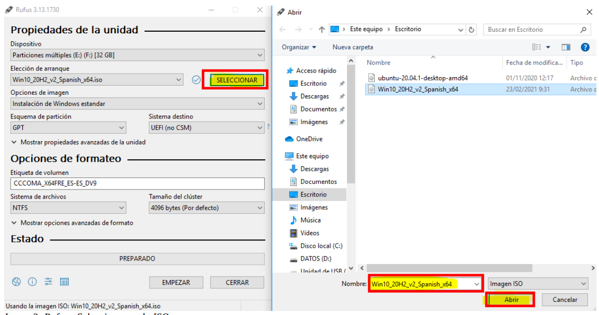
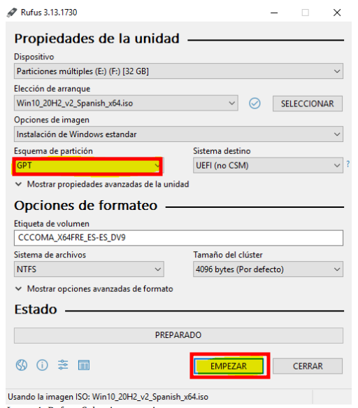
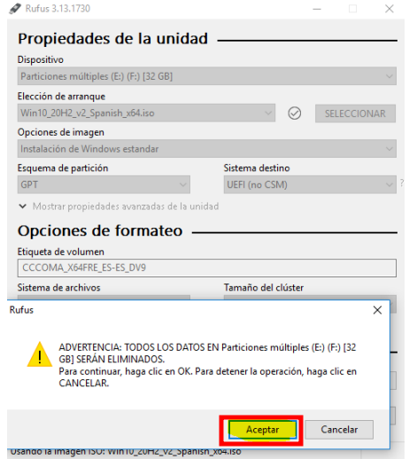
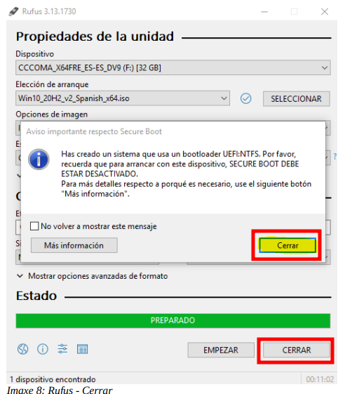

# 🪟🚫 error_0xc0000098
 

**📑 Indice**
- [🪟🚫 error\_0xc0000098](#-error_0xc0000098)
- [🚫⚠️ Error de Actulizaciones de Windows](#️-error-de-actulizaciones-de-windows)
  - [1. 🚀 Medio de Instalación *``RUFUS``* (Solición Rápida)](#1--medio-de-instalación-rufus-solición-rápida)

 

# 🚫⚠️ Error de Actulizaciones de Windows
 

En este repositorio vamos a ver cómo actuar frente al *``error 0xc0000098``* , uno de los problemas más comunes en Windows.
   - 🔧 Analizaremos su causa
   - 🛠️ Exploraremos soluciones paso a paso
   - ⬆️ Y cómo evitarlo en futuras actualizaciones del sistema

 

## 1. 🚀 Medio de Instalación *``RUFUS``* (Solición Rápida)
 

Arranca con un medio de instalación *``(USB/DVD)``* de Windows . Y ahí instala 
el sistema operativo desde el principio .

1 - Descargar e instalar los paquetes necesarios para la recuperación del sistema , lo que vamos ha utilizar es *``RUFUS``* y una *``ISO``* de windows .

 
 

2 - Iniciamos el *``RUFUS``* , selecionamos la *``iso``* que hemos descargado y le damos formato .

 
 

3 - Damos formato *``gpt``* (para equipos actuales) o *``mbr``* (para equipos antiguos)
usalo segun tu equipo y empezamos .

 
 

4 - Una vez empezando la instalación nos muestra un mensaje de ⚠️ advertencia que nos dice que se borraran todos los datos de en el *``usb``* solo quedará el medio de instalación .

 
 

5 - Al terminar *``CERRAMOS``* si volvemos a *``EMPEZAR``* nos inicia la instalación de nuevo , ojo con eso .

 
 

**⚠️ Inconveniente**
>
>Si haces esto vas ha perder todos los datos que tienes ahí y se borran todas las actulizaciones que pudieron corromper al sistema