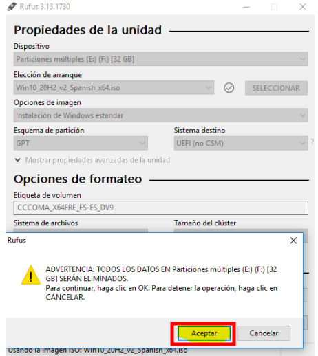

# error_0xc0000098

## Error de Actulizaciones de Windows 

1. **Solición Rápida**

Arranca con un medio de instalación (USB/DVD) de Windows . Y ahí instala 
el sistema operativo desde el principio .

1 - Lo primero que tenemos que hacer es descargar e instalar los paquetes necesarios para la recuperación del sistema , lo que vamos ha utilizar es **RUFUS** y una **ISO** de windows .

 

2 - Luego iniciamos el **RUFUS** , selecioanamos la iso que hemos descargado y le damos formato 

 

3 - Seleccionamos el formato **GPT** (para equipos actuales) o **MBR** (para equipos antiguos)
usalo segun tu equipo y le hacemos clic en el botón de empezar .

 

4 - Una vez empezando la instalación nos muestra un mensaje de advertencia que nos dice que se borran todos los datos de nuestro **USB** y solo quedara en medio de isntalación .

 

5 - Cuando termine hacemos clic en **CERRAR** porque si hacemos clic en empezar , nos empezara la instalación de nuevo , ojo con eso .

**Inconvenicia**
 
si haces esto vas ha perder todos los datos que tienes ahí y se borran todas las
actulizaciones que pudieron corromper al sistema